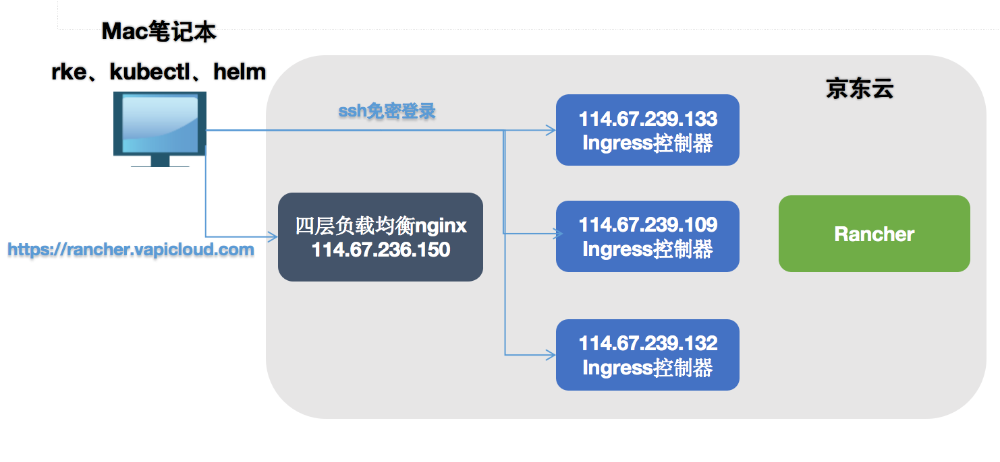
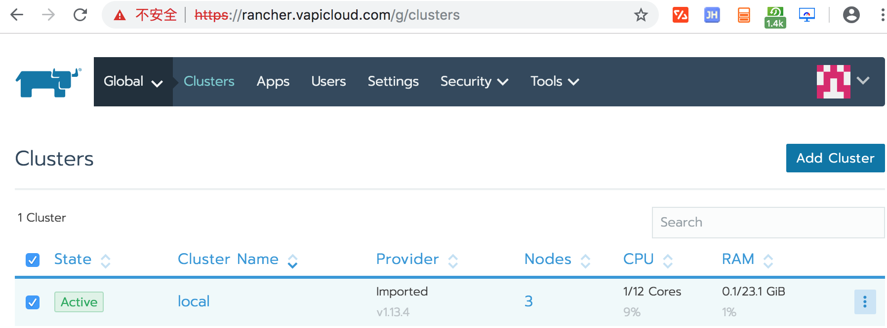
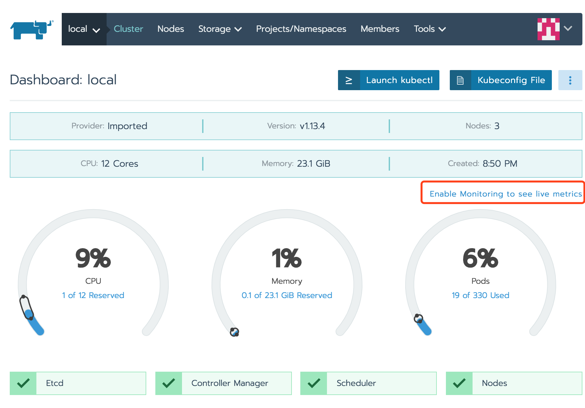
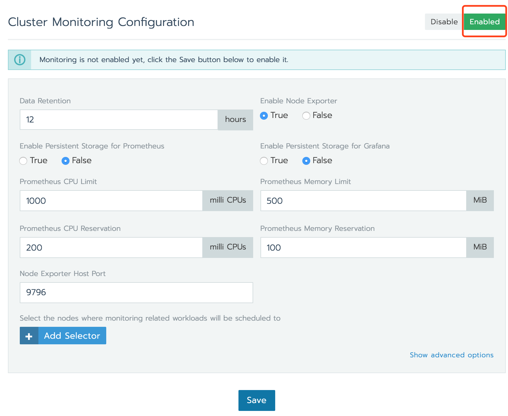
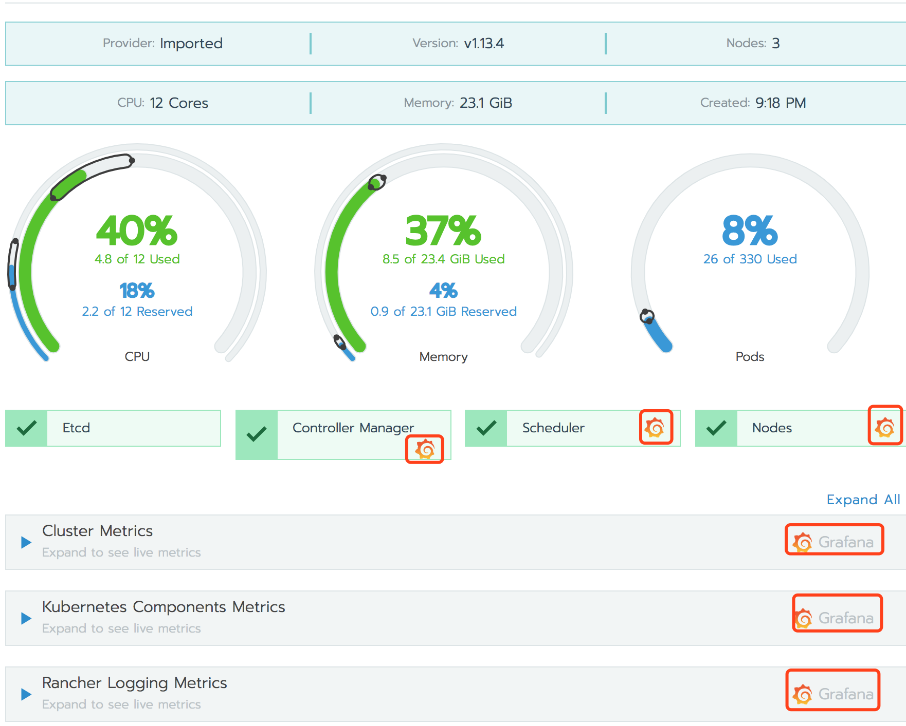
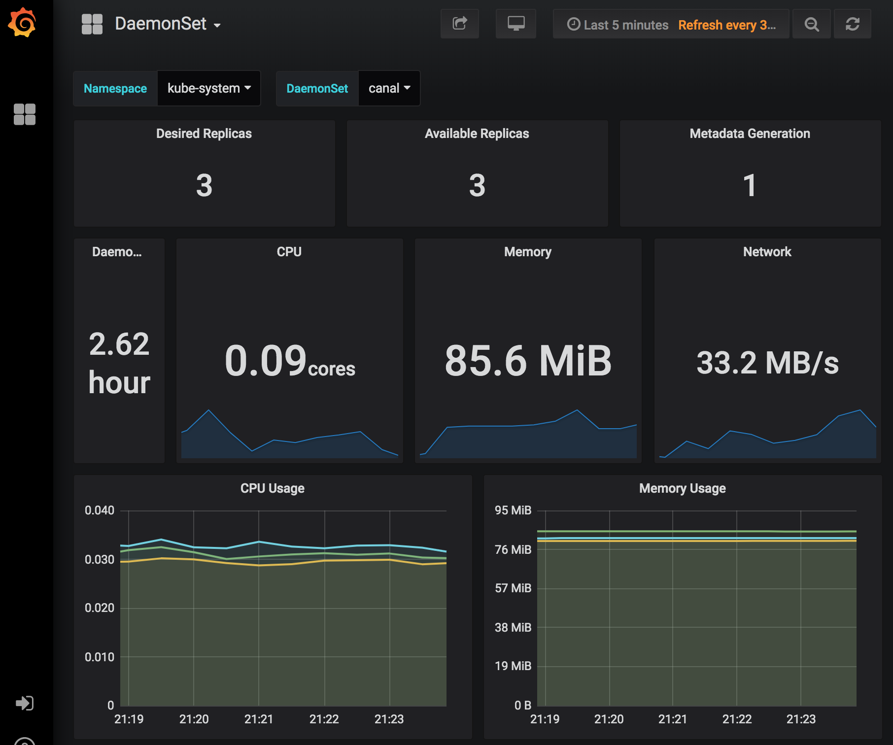

# 京东云上使用 Helm 安装部署高可用 Rancher HA

## 部署架构

参考

[Helm HA安装](https://www.cnrancher.com/docs/rancher/v2.x/cn/installation/ha-install/helm-rancher/)
https://www.cnrancher.com/docs/rancher/v2.x/cn/installation/ha-install/helm-rancher/



## 环境准备

### 必备工具

此架构安装需要以下CLI工具。

* kubectl - Kubernetes命令行工具。
* rke - Rancher Kubernetes Engine用于构建Kubernetes集群。
* helm - Kubernetes的包管理。

我的客户端为MAC 具体安装过程详见:

[MAC环境安装CLI工具](mac-client.md)

### 域名

登录自己的域名服务商配置域名解析：

rancher.vapicloud.com   114.67.236.150

IP地址为4层负载均衡（nginx）地址 114.67.236.150

## 配置负载均衡器(以NGINX为例)

我们将使用NGINX作为第4层负载均衡器(TCP)。NGINX会将所有连接转发到你的Rancher节点之一。

### 一台2核8G京东云主机

配置规格： c.n2.xlarge 计算优化 标准型
操作系统： Ubuntu 16.04

### 安装nginx

``` bash
sudo apt-get update
sudo apt-get install nginx

```

### 配置nginx

```bash

mv /etc/nginx/nginx.conf /etc/nginx/nginx.conf.bak
cat > /etc/nginx/nginx.conf <<EOF
user www-data;

pid /run/nginx.pid;

worker_processes 4;
worker_rlimit_nofile 40000;

events {
    worker_connections 8192;
}

stream {
    upstream rancher_servers_http {
        least_conn;
        server 114.67.239.133:80 max_fails=3 fail_timeout=5s;
        server 114.67.239.109:80 max_fails=3 fail_timeout=5s;
        server 114.67.239.132:80 max_fails=3 fail_timeout=5s;
    }
    server {
        listen     80;
        proxy_pass rancher_servers_http;
    }

    upstream rancher_servers_https {
        least_conn;
        server 114.67.239.132:443 max_fails=3 fail_timeout=5s;
        server 114.67.239.132:443 max_fails=3 fail_timeout=5s;
        server 114.67.239.132:443 max_fails=3 fail_timeout=5s;
    }
    server {
        listen     443;
        proxy_pass rancher_servers_https;
    }
}
EOF

nginx -s reload

```

## Rancher HA主机配置

### 三台4核8G京东云主机

配置规格： c.n2.xlarge 计算优化 标准型

操作系统： Ubuntu 16.04

```
rancherha1  114.67.239.133 （公） 10.1.1.7 （内）

rancherha2  114.67.239.109 （公） 10.1.1.5 （内）

rancherha3  114.67.239.132 （公） 10.1.1.6 （内）


```

### 配置 Hosts

```
cat <<EOF >> /etc/hosts
10.1.1.7   rancherha1
10.1.1.5   rancherha2
10.1.1.6   rancherha3
EOF
```
### 配置主机时间、时区、系统语言

查看时区

```
date -R 或者 timedatectl
```

修改时区

```
ln -sf /usr/share/zoneinfo/Asia/Shanghai /etc/localtime
```

修改系统语言环境

```
sudo echo 'LANG="en_US.UTF-8"' >> /etc/profile;source /etc/profile
```

配置主机NTP时间同步

### Kernel性能调优

```
cat >> /etc/sysctl.conf<<EOF
net.ipv4.ip_forward=1
net.ipv4.neigh.default.gc_thresh1=4096
net.ipv4.neigh.default.gc_thresh2=6144
net.ipv4.neigh.default.gc_thresh3=8192
EOF
```

数值根据实际环境自行配置，最后执行 `sysctl -p` 保存配置。


## docker 安装与配置

### 修改系统源

``` bash
sudo cp /etc/apt/sources.list /etc/apt/sources.list.bak
cat > /etc/apt/sources.list << EOF

deb http://mirrors.aliyun.com/ubuntu/ xenial main
deb-src http://mirrors.aliyun.com/ubuntu/ xenial main
deb http://mirrors.aliyun.com/ubuntu/ xenial-updates main
deb-src http://mirrors.aliyun.com/ubuntu/ xenial-updates main
deb http://mirrors.aliyun.com/ubuntu/ xenial universe
deb-src http://mirrors.aliyun.com/ubuntu/ xenial universe
deb http://mirrors.aliyun.com/ubuntu/ xenial-updates universe
deb-src http://mirrors.aliyun.com/ubuntu/ xenial-updates universe
deb http://mirrors.aliyun.com/ubuntu/ xenial-security main
deb-src http://mirrors.aliyun.com/ubuntu/ xenial-security main
deb http://mirrors.aliyun.com/ubuntu/ xenial-security universe
deb-src http://mirrors.aliyun.com/ubuntu/ xenial-security universe

EOF
```

### Docker-ce安装

```bash
# 添加用户(可选)
sudo adduser rancherha
# 为新用户设置密码
sudo passwd rancherha
# 为新用户添加sudo权限
sudo echo 'rancherha ALL=(ALL) ALL' >> /etc/sudoers

# 定义安装版本
export docker_version=18.09.3
# step 1: 安装必要的一些系统工具
sudo apt-get update
sudo apt-get -y install apt-transport-https ca-certificates curl software-properties-common bash-completion
# step 2: 安装GPG证书
sudo curl -fsSL http://mirrors.aliyun.com/docker-ce/linux/ubuntu/gpg | sudo apt-key add -
# Step 3: 写入软件源信息
sudo add-apt-repository "deb [arch=amd64] http://mirrors.aliyun.com/docker-ce/linux/ubuntu $(lsb_release -cs) stable"
# Step 4: 更新并安装 Docker-CE
sudo apt-get -y update
version=$(apt-cache madison docker-ce|grep ${docker_version}|awk '{print $3}')
# --allow-downgrades 允许降级安装
sudo apt-get -y install docker-ce=${version} --allow-downgrades
# 设置开机启动
sudo systemctl enable docker
#将登陆用户加入到docker用户组中
sudo gpasswd -a rancherha docker
#更新用户组
newgrp docker
```

### Docker 配置

```
cat > /etc/docker/daemon.json << EOF
{
"max-concurrent-downloads": 3,
"max-concurrent-uploads": 5
}
{
"registry-mirrors": ["https://h10nguty.mirror.aliyuncs.com","https://registry.docker-cn.com"]
}
{
"storage-driver": "overlay2",
"storage-opts": ["overlay2.override_kernel_check=true"]
}
{
"log-driver": "json-file",
"log-opts": {
    "max-size": "100m",
    "max-file": "3"
    }
}
EOF
```

### docker info 提示 WARNING: No swap limit support

```
sudo sed -i 's/GRUB_CMDLINE_LINUX="/GRUB_CMDLINE_LINUX="cgroup_enable=memory swapaccount=1  /g'  /etc/default/grub
sudo update-grub
```
重启生效

## RKE 部署 Kubernetes

### 下载安装 RKE

详见
[MAC环境安装CLI工具](mac-client.md)

### 配置客户端到服务器的ssh免密登录

```
ssh-copy-id -i ~/.ssh/id_rsa.pub rancherha@114.67.239.133
ssh-copy-id -i ~/.ssh/id_rsa.pub rancherha@114.67.239.109
ssh-copy-id -i ~/.ssh/id_rsa.pub rancherha@114.67.239.132
```

### 创建 rancher-cluster.yml 文件

```
nodes:
  - address: 114.67.239.133
    internal_address: 10.1.1.7
    user: rancherha
    role: [controlplane,worker,etcd]
  - address: 114.67.239.109
    internal_address: 10.1.1.5
    user: rancherha
    role: [controlplane,worker,etcd]
  - address: 114.67.239.132
    internal_address: 10.1.1.6
    user: rancherha
    role: [controlplane,worker,etcd]
services:
  etcd:
    snapshot: true
    creation: 6h
    retention: 24h
```

internal_address 为内网 ip，可不配置。

### 使用 RKE 命令创建 Kubernetes 集群

```
rke up --config ./rancher-cluster.yml
```

完成后，它应显示：Finished building Kubernetes cluster successfully。


### 下载安装 Kubectl，测试集群

详见
[MAC环境安装CLI工具](mac-client.md)

RKE应该已经创建了一个文件kube_config_rancher-cluster.yml。这个文件包含kubectl和helm访问K8S的凭据。

可以将此文件复制到$HOME/.kube/config，通过kubectl测试您的连接，并查看所有节点是否处于Ready状态。

```
$ mkdir -p ~/.kube
$ cp kube_config_rancher-cluster.yml ~/.kube/config

$ kubectl get nodes
NAME             STATUS   ROLES                      AGE    VERSION
114.67.239.109   Ready    controlplane,etcd,worker   100s   v1.13.4
114.67.239.132   Ready    controlplane,etcd,worker   100s   v1.13.4
114.67.239.133   Ready    controlplane,etcd,worker   100s   v1.13.4

$ kubectl get pods --all-namespaces
NAMESPACE       NAME                                      READY   STATUS      RESTARTS   AGE
ingress-nginx   default-http-backend-78fccfc5d9-stf5q     1/1     Running     0          3m57s
ingress-nginx   nginx-ingress-controller-cwx6n            1/1     Running     0          3m57s
ingress-nginx   nginx-ingress-controller-fgn6q            1/1     Running     0          3m57s
ingress-nginx   nginx-ingress-controller-vm6hq            1/1     Running     0          3m57s
kube-system     canal-ccj52                               2/2     Running     0          4m12s
kube-system     canal-l2hj5                               2/2     Running     0          4m12s
kube-system     canal-rrsgv                               2/2     Running     0          4m12s
kube-system     kube-dns-58bd5b8dd7-dd9sk                 3/3     Running     0          4m7s
kube-system     kube-dns-autoscaler-77bc5fd84-qkj7j       1/1     Running     0          4m6s
kube-system     metrics-server-58bd5dd8d7-r6px7           1/1     Running     0          4m2s
kube-system     rke-ingress-controller-deploy-job-xnmgq   0/1     Completed   0          3m59s
kube-system     rke-kube-dns-addon-deploy-job-zfphl       0/1     Completed   0          4m9s
kube-system     rke-metrics-addon-deploy-job-2zzd8        0/1     Completed   0          4m4s
kube-system     rke-network-plugin-deploy-job-hkt44       0/1     Completed   0          4m14s
```

## 安装配置 Helm

### 配置 Helm 客户端访问权限

Helm在集群上安装`tiller`服务以管理`charts`. 由于RKE默认启用RBAC, 因此我们需要使用`kubectl`来创建一个`serviceaccount`，`clusterrolebinding`才能让`tiller`具有部署到集群的权限。

- 在kube-system命名空间中创建`ServiceAccount`；

- 创建`ClusterRoleBinding`以授予tiller帐户对集群的访问权限

- `helm`初始化`tiller`服务

  ```bash
  kubectl -n kube-system create serviceaccount tiller
  kubectl create clusterrolebinding tiller --clusterrole cluster-admin --serviceaccount=kube-system:tiller
  ```

### 安装 Helm 客户端

详见
[MAC环境安装CLI工具](mac-client.md)

### 安装 Helm Server (Tiller)

安装`tiller`到集群中最简单的方法就是运行`helm init`。这将验证`helm`本地环境设置是否正确(并在必要时进行设置)。然后它会连接到`kubectl`默认连接的K8S集群(`kubectl config view`)。一旦连接，它将安装`tiller`到`kube-system`命名空间中。

`helm init`自定义参数:

- `--canary-image` 参数安装金丝雀版本;
- `--tiller-image` 安装特定的镜像(版本);
- `--kube-context` 使用安装到特定集群;
- `--tiller-namespace` 用一个特定的命名空间(namespace)安装;

> **注意:**1、RKE默认启用RBAC,所以在安装`tiller`时需要指定`ServiceAccount`。
> 2、`helm init`在缺省配置下，会去谷歌镜像仓库拉取`gcr.io/kubernetes-helm/tiller`镜像，在Kubernetes集群上安装配置Tiller；由于在国内可能无法访问`gcr.io、storage.googleapis.com`等域名，可以通过`--tiller-image`指定私有镜像仓库镜像。
> 3、`helm init`在缺省配置下，会利用`https://kubernetes-charts.storage.googleapis.com`作为缺省的`stable repository`地址,并去更新相关索引文件。在国内可能无法访问`storage.googleapis.com`地址, 可以通过`--stable-repo-url`指定`chart`国内加速镜像地址。
> 4、如果你是离线安装`Tiller`, 假如没有内部的`chart`仓库, 可通过添加`--skip-refresh`参数禁止`Tiller`更新索引。

```shell
# 安装 Tiller ($TILLER_TAG 改为和 helm version 版本一致)
helm init --service-account tiller --tiller-image registry.cn-shanghai.aliyuncs.com/rancher/tiller:$TILLER_TAG --stable-repo-url https://kubernetes.oss-cn-hangzhou.aliyuncs.com/charts
helm version
# 卸载 Tiller
kubectl delete deployment tiller-deploy --namespace kube-system
```

## Helm 安装 Rancher

### 添加 Chart 仓库地址

使用`helm repo add`命令添加Rancher chart仓库地址,访问[Rancher tag和Chart版本](https://www.cnrancher.com/docs/rancher/v2.x/cn/installation/server-tags/)

替换`<CHART_REPO>`为您要使用的Helm仓库分支(即latest或stable）。

```shell
helm repo add rancher-latest https://releases.rancher.com/server-charts/latest
```

### 安装证书管理器

> **注意:**只有Rancher自动生成的证书和LetsEncrypt颁发的证书才需要`cert-manager`。如果是你自己的证书，可使用`ingress.tls.source=secret`参数指定证书，并跳过此步骤。**重要提示:**由于Helm v2.12.0和cert-manager存在问题，请使用Helm v2.12.1或更高版本。

Rancher依靠`Kubernetes Helm stable`仓库中的[cert-manager](https://github.com/kubernetes/charts/tree/master/stable/cert-manager)来颁发自签名或LetsEncrypt证书.

从Helm stable目录安装`cert-manager`。

```bash
helm install stable/cert-manager --name cert-manager --namespace kube-system
```

### 选择 SSL 配置方式并安装 Rancher server

Rancher server设计默认需要开启SSL/TLS配置来保证安全。

证书来源有三种选择：

- `rancher` - 使用Rancher自动生成`CA/Certificates`证书(默认)。
- `letsEncrypt` - 使用`LetsEncrypt`颁发证书。
- `secret` - 使用`Kubernetes Secret`证书配置文件。

默认情况下，Rancher会自动生成`CA根证书`并使用`cert-manager`颁发证书以访问Rancher server界面。

唯一的要求是将`hostname`配置为访问Rancher的域名地址，使用这种SSL证书配置方式需提前安装[证书管理器](https://www.cnrancher.com/docs/rancher/v2.x/cn/installation/ha-install/helm-rancher/tcp-l4/rancher-install/#%E4%BA%8C-%E5%AE%89%E8%A3%85%E8%AF%81%E4%B9%A6%E7%AE%A1%E7%90%86%E5%99%A8-%E5%8F%AF%E9%80%89)。

> 修改`hostname`

```bash
helm install rancher-latest/rancher --name rancher --namespace cattle-system --set hostname=rancher.vapicloud.com
```

查看pod状态，三个 rancher POD 正在创建中

```
$ kubectl get pods --all-namespaces
NAMESPACE       NAME                                        READY   STATUS              RESTARTS   AGE
cattle-system   rancher-57f4fdc5bb-69rcv                    0/1     ContainerCreating   0          8s
cattle-system   rancher-57f4fdc5bb-6bfsc                    0/1     ContainerCreating   0          8s
cattle-system   rancher-57f4fdc5bb-szmkx                    0/1     ContainerCreating   0          8s
ingress-nginx   default-http-backend-78fccfc5d9-stf5q       1/1     Running             0          47m
ingress-nginx   nginx-ingress-controller-cwx6n              1/1     Running             0          47m
ingress-nginx   nginx-ingress-controller-fgn6q              1/1     Running             0          47m
ingress-nginx   nginx-ingress-controller-vm6hq              1/1     Running             0          47m
kube-system     canal-ccj52                                 2/2     Running             0          48m
kube-system     canal-l2hj5                                 2/2     Running             0          48m
kube-system     canal-rrsgv                                 2/2     Running             0          48m
kube-system     cert-manager-cert-manager-bcfbff747-xnwnz   2/2     Running             0          14m
kube-system     kube-dns-58bd5b8dd7-dd9sk                   3/3     Running             0          48m
kube-system     kube-dns-autoscaler-77bc5fd84-qkj7j         1/1     Running             0          48m
kube-system     metrics-server-58bd5dd8d7-r6px7             1/1     Running             0          47m
kube-system     rke-ingress-controller-deploy-job-xnmgq     0/1     Completed           0          47m
kube-system     rke-kube-dns-addon-deploy-job-zfphl         0/1     Completed           0          48m
kube-system     rke-metrics-addon-deploy-job-2zzd8          0/1     Completed           0          47m
kube-system     rke-network-plugin-deploy-job-hkt44         0/1     Completed           0          48m
kube-system     tiller-deploy-58464584d7-x97bc              1/1     Running             0          16m
````

过一会再查看pod状态，三个 rancher POD 变成 `Runing` 状态。

此时就可以登录Rancher的UI界面了：

https://rancher.vapicloud.com/


```
$ kubectl get pods --all-namespaces
NAMESPACE       NAME                                        READY   STATUS      RESTARTS   AGE
cattle-system   rancher-57f4fdc5bb-69rcv                    1/1     Running     1          89s
cattle-system   rancher-57f4fdc5bb-6bfsc                    1/1     Running     1          89s
cattle-system   rancher-57f4fdc5bb-szmkx                    1/1     Running     2          89s
ingress-nginx   default-http-backend-78fccfc5d9-stf5q       1/1     Running     0          49m
ingress-nginx   nginx-ingress-controller-cwx6n              1/1     Running     0          49m
ingress-nginx   nginx-ingress-controller-fgn6q              1/1     Running     0          49m
ingress-nginx   nginx-ingress-controller-vm6hq              1/1     Running     0          49m
kube-system     canal-ccj52                                 2/2     Running     0          49m
kube-system     canal-l2hj5                                 2/2     Running     0          49m
kube-system     canal-rrsgv                                 2/2     Running     0          49m
kube-system     cert-manager-cert-manager-bcfbff747-xnwnz   2/2     Running     0          15m
kube-system     kube-dns-58bd5b8dd7-dd9sk                   3/3     Running     0          49m
kube-system     kube-dns-autoscaler-77bc5fd84-qkj7j         1/1     Running     0          49m
kube-system     metrics-server-58bd5dd8d7-r6px7             1/1     Running     0          49m
kube-system     rke-ingress-controller-deploy-job-xnmgq     0/1     Completed   0          49m
kube-system     rke-kube-dns-addon-deploy-job-zfphl         0/1     Completed   0          49m
kube-system     rke-metrics-addon-deploy-job-2zzd8          0/1     Completed   0          49m
kube-system     rke-network-plugin-deploy-job-hkt44         0/1     Completed   0          49m
kube-system     tiller-deploy-58464584d7-x97bc              1/1     Running     0          18m
```

第一次访问要求初始用户名，密码。 管理员用户默认为admin

配置 Rancher Server URL 为 rancher.vapicloud.com

登录后还需要一会 local Clusters 的状态变为Running 状态

```
$ kubectl get pods --all-namespaces
NAMESPACE       NAME                                        READY   STATUS      RESTARTS   AGE
cattle-system   cattle-cluster-agent-bf95d5d98-8z4pl        1/1     Running     0          21m
cattle-system   cattle-node-agent-6wvn8                     1/1     Running     0          21m
cattle-system   cattle-node-agent-cpwd2                     1/1     Running     0          21m
cattle-system   cattle-node-agent-lgbkr                     1/1     Running     0          21m
cattle-system   rancher-57f4fdc5bb-69rcv                    1/1     Running     1          69m
cattle-system   rancher-57f4fdc5bb-6bfsc                    1/1     Running     1          69m
cattle-system   rancher-57f4fdc5bb-szmkx                    1/1     Running     2          69m
ingress-nginx   default-http-backend-78fccfc5d9-stf5q       1/1     Running     0          117m
ingress-nginx   nginx-ingress-controller-cwx6n              1/1     Running     0          117m
ingress-nginx   nginx-ingress-controller-fgn6q              1/1     Running     0          117m
ingress-nginx   nginx-ingress-controller-vm6hq              1/1     Running     0          117m
kube-system     canal-ccj52                                 2/2     Running     0          117m
kube-system     canal-l2hj5                                 2/2     Running     0          117m
kube-system     canal-rrsgv                                 2/2     Running     0          117m
kube-system     cert-manager-cert-manager-bcfbff747-xnwnz   2/2     Running     0          83m
kube-system     kube-dns-58bd5b8dd7-dd9sk                   3/3     Running     0          117m
kube-system     kube-dns-autoscaler-77bc5fd84-qkj7j         1/1     Running     0          117m
kube-system     metrics-server-58bd5dd8d7-r6px7             1/1     Running     0          117m
kube-system     rke-ingress-controller-deploy-job-xnmgq     0/1     Completed   0          117m
kube-system     rke-kube-dns-addon-deploy-job-zfphl         0/1     Completed   0          117m
kube-system     rke-metrics-addon-deploy-job-2zzd8          0/1     Completed   0          117m
kube-system     rke-network-plugin-deploy-job-hkt44         0/1     Completed   0          117m
kube-system     tiller-deploy-58464584d7-x97bc              1/1     Running     0          86m
```




## 开启监控

在 `Dashboard local` 界面点击 `Enable Monitoring to see metrics`







点击 `Save` 保存



等一会，界面提示 `Monitoring API is not ready`
消失，并出现grafana图标，就可以点击grafana图标查看监控信息了。


本次Rancher HA的安装告一段落。
