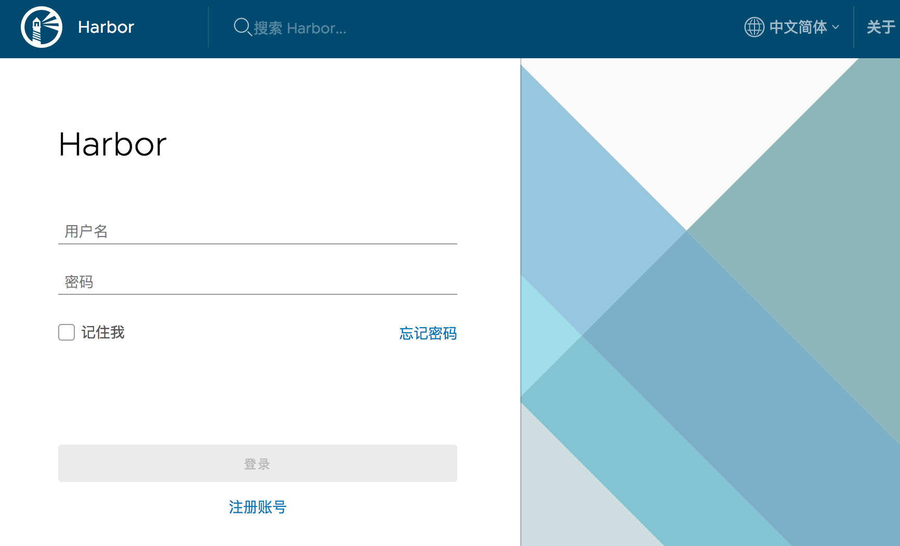

# 阿里云Ubuntu离线安装最新的Harbor 1.8.1

## 下载离线安装包

[离线安装包下载地址](https://github.com/goharbor/harbor/releases)
https://github.com/goharbor/harbor/releases

也可以直接执行以下命令进行下载和解压

```
wget https://storage.googleapis.com/harbor-releases/release-1.8.0/harbor-offline-installer-v1.8.1.tgz

tar xzf harbor-offline-installer-v1.8.1.tgz

```

## 准备2核8G云主机

Ubuntu 16.04

60.205.215.85 （公）

## 安装 Docker 和 docker-compose 环境

执行脚本
[install-docker-ubuntu1604.sh](install-docker-ubuntu1604.sh)

### 配置 Harbor

vi harbor.yml

```
hostname: 60.205.215.85
http:
  port: 8080
```

### 执行准备脚本
```
./prepare
```

## 安装 Harbor

./install.sh

## 浏览器访问

登录地址： https://60.205.215.85:8080



默认登录用户名：密码 admin : Harbor12345

记得登录后记得`修改密码`

登录后创建名为`mytest`的项目

## 测试镜像推送

客户端推送镜像到自建的镜像仓库

### 登录镜像仓库

```
$ docker logout 60.205.215.85:8080
Removing login credentials for 60.205.215.85:8080
WARNING: could not erase credentials: error erasing credentials - err: exit status 1, out: `The specified item could not be found in the keychain.`
192:~ william$ docker login 60.205.215.85:8080
Username: admin
Password:
Error response from daemon: Get https://60.205.215.85:8080/v2/: http: server gave HTTP response to HTTPS client
```

登录报错  原因是 docker 登录镜像库默认使用 https 协议 harbor 默认使用 http 协议。 需要将harbor地址加入到docker 非安全镜像库配置中

### Mac 下添加非安全镜像库的方法：

docker Preferences... ---> Daemon ---> Basic

在 Insecure registries 中增加：

60.205.215.85:8080

点击 `Apply & Restart`

### Ubuntu 下添加非安全镜像库的方法：

```
vim /etc/docker/daemon.json
{
   "registry-mirrors": [
      "https://h10nguty.mirror.aliyuncs.com"
   ],
   "insecure-registries": [
      "60.205.215.85:8080"
    ]
}
```

```
$ docker login 60.205.215.85:8080
Username: admin
Password:
Login Succeeded
```

### 将要上传的镜像打tag

```
docker tag postgres:9.3.24 60.205.215.85:8080/mytest/postgres:9.3.24
```

### 推送镜像到镜像仓库

```
docker push 60.205.215.85:8080/mytest/postgres:9.3.24
```

### 在Harbor 控制台查看推送结果
