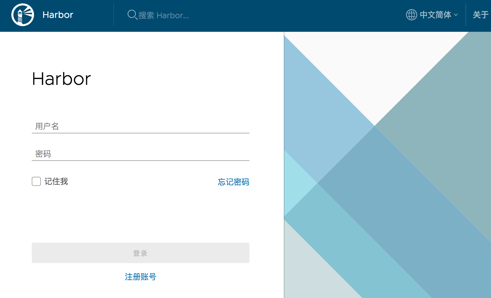
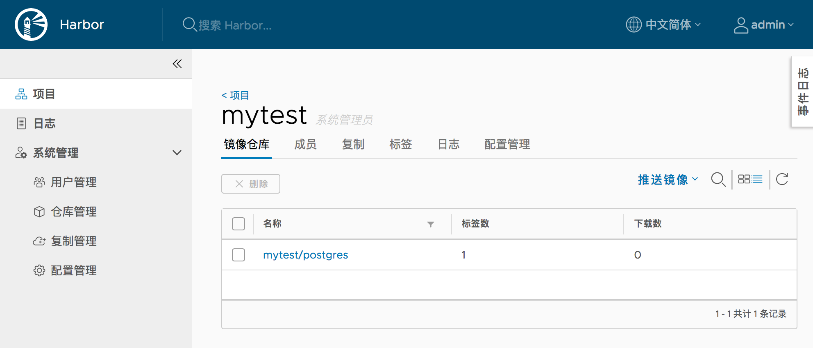

# 离线安装最新的Harbor 1.7.5

## 下载离线安装包

[离线安装包下载地址](https://github.com/goharbor/harbor/releases)
https://github.com/goharbor/harbor/releases

也可以直接执行以下命令进行下载和解压

```
wget https://storage.googleapis.com/harbor-releases/release-1.7.0/harbor-offline-installer-v1.7.5.tgz

tar xzf harbor-offline-installer-v1.7.5.tgz

```

## 准备2核8G云主机

Ubuntu1
g.n2.large 通用 标准型

116.196.115.248 （公）
10.1.1.8 （内）

## 配置域名

reg.vapicloud.com  116.196.115.248

## 安装 Docker 和 docker-compose 环境

执行脚本
[install-docker-ubuntu1604.sh](install-docker-ubuntu1604.sh)

## 配置Harbor支持https

[配置Harbor支持https](https://github.com/goharbor/harbor/blob/master/docs/configure_https.md#Troubleshooting)

### 生成证书和秘钥

生成证书和秘钥的脚本:

[create-cert.sh](create-cert.sh)

执行前修改脚本中域名和证书申请信息

执行 `create-cert.sh` 生成并配置证书和秘钥

配置证书和秘钥的脚本：

[config-ssl.sh](config-ssl.sh)

执行前修改脚本中域名和证书申请信息

执行 `config-ssl.sh` 生成并配置证书和秘钥

### 配置 Harbor


vi harbor.cfg

```
hostname = reg.vapicloud.com

ui_url_protocol = https

ssl_cert = /data/cert/reg.vapicloud.com.crt
ssl_cert_key = /data/cert/reg.vapicloud.com.key
```

./prepare

## 安装 Harbor

./install.sh

## 浏览器访问

登录地址： https://reg.vapicloud.com



默认登录用户名：密码 admin : Harbor12345

记得登录后记得`修改密码`

登录后创建名为`mytest`的项目

## 测试镜像推送

客户端推送镜像到自建的镜像仓库

### 登录镜像仓库

```
$ docker login reg.vapicloud.com
Authenticating with existing credentials...
Stored credentials invalid or expired
Username (admin): admin
Password:
Login Succeeded
```

### 将要上传的镜像打tag

```
docker tag postgres:9.3.24 reg.vapicloud.com/mytest/postgres:9.3.24
```

### 推送镜像到镜像仓库

```
docker push reg.vapicloud.com/mytest/postgres:9.3.24
```

### 在Harbor 控制台查看推送结果



## mac端docker配置的问题

### 问题

从mac笔记本登录私有镜像中心，登录时出现错误提示：

```
$ docker login reg.vapicloud.com
Authenticating with existing credentials...
Login did not succeed, error: Error response from daemon: Get https://reg.vapicloud.com/v2/: x509: certificate signed by unknown authority
```

### 原因

私有镜像中心的证书不可信，需要添加私有镜像中心的认证证书。

### 解决方法

刚才生成的私有镜像中心的认证证书为ca.crt, 那么执行如下命令：

```
sudo security add-trusted-cert -d -r trustRoot -k /Library/Keychains/System.keychain ca.crt
```

重启Docker，重新登录即可。

```
$ docker login reg.vapicloud.com
Authenticating with existing credentials...
Login Succeeded
```
